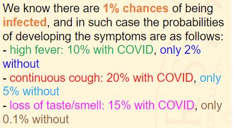

Probability& BayesianNetworks (Part A)

# Lavoriamo con le probabilità in Python!

Vogliamo calcolare la probabilità di avere il COVID-19 basandoci su tre possibili sintomi:

* Febbre
* Tosse

* Perdita gusto



Sappiamo che c'è la probabilità dell' 1% di essere infettati, in tale caso la probabilità di sviluppare i sintomi è la seguente:

* Febbre: 10% con COVID, 2% senza
* Tosse: 20% con COVID, 5% senza
* Perdita gusto: 15% con COVID, 0.1% senza

Abbiamo **4 variabili aleatorie**, che possono assumere valore *vero* o *falso*

* Malato COVID $D,d$ non malato covid $¬d$
* Febbre $F,f$ senza febbre $¬f$
* Tosse $C,c$ senza tosse $¬c$
* Perdita gusto $L,l$ senza $¬l$

QUESTION: What is the probability of having COVID given the presence of all the three symptoms? Dobbaimo computare la probabilità $P(d|f,c,l)$

```
import numpy as np
p_disease = np.array([0.01,0.99])
```

Applichiamo la regola diByes, possiamo scrivere:

$$
\begin{equation}P(d|f,c,l)=\frac{P(f,c,l|d)P(d)}{P(f,c,l)}\end{equation}
$$

Al numeratore abbiamo ...

---

## Bayesian Network in Python
